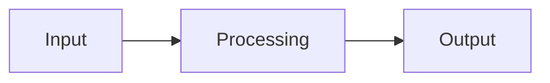

# renalprog Documentation

This directory contains the documentation for the `renalprog` package, built with [MkDocs](https://www.mkdocs.org/) and the [Material theme](https://squidfunk.github.io/mkdocs-material/).

## 🆘 Having Issues?

**Start here if you're encountering errors:**

- **[SUMMARY.md](SUMMARY.md)** - Complete fix guide with step-by-step instructions
- **[QUICK_FIX_v2.md](QUICK_FIX_v2.md)** - Quick reference for common issues
- **[CHECKLIST.md](CHECKLIST.md)** - Track your documentation progress

## 🚀 Quick Start

### Prerequisites

The `renalprog` package **must be installed** for documentation to build:

```bash
# From repository root
cd /mnt/d/Repos/renalprog
pip install -e .
```

### Preview Locally (Ubuntu/WSL)

```bash
# Verify installation first
cd /mnt/d/Repos/renalprog/docs
python test_imports.py

# If successful, start the server
mkdocs serve
```

Then open http://127.0.0.1:8000 in your browser.

**Auto-reload:** MkDocs will automatically rebuild when you edit `.md` files.

### Deploy to GitHub Pages

```bash
cd /mnt/d/Repos/renalprog/docs
mkdocs gh-deploy
```

This will build the documentation and push it to the `gh-pages` branch, making it available at:
https://gprolcastelo.github.io/renalprog/

## 📁 Structure

```
docs/
├── mkdocs.yml              # MkDocs configuration
├── requirements.txt        # Python dependencies for docs
├── README.md              # This file
└── docs/                  # Documentation content
    ├── index.md           # Homepage
    ├── getting-started.md # Installation guide
    ├── tutorials/         # Step-by-step tutorials
    │   ├── index.md
    │   ├── quickstart.md
    │   ├── step1-data-processing.md
    │   ├── step2-vae-training.md
    │   ├── step3-reconstruction.md
    │   ├── step4-trajectories.md
    │   ├── step5-classification.md
    │   └── step6-enrichment.md
    ├── reproducibility/   # Guides for reproducing paper results
    │   ├── index.md
    │   ├── requirements.md
    │   ├── data-preparation.md
    │   ├── pipeline.md
    │   ├── results.md
    │   └── troubleshooting.md
    ├── api/               # API reference documentation
    │   ├── index.md
    │   ├── config.md
    │   ├── dataset.md
    │   ├── features.md
    │   ├── models.md
    │   ├── training.md
    │   ├── prediction.md
    │   ├── trajectories.md
    │   ├── classification.md
    │   ├── enrichment.md
    │   ├── plots.md
    │   └── utils.md
    ├── advanced/          # Advanced topics
    │   ├── architecture.md
    │   ├── r-integration.md
    │   ├── custom-models.md
    │   ├── performance.md
    │   └── gpu.md
    ├── stylesheets/       # Custom CSS
    │   └── extra.css
    └── javascripts/       # Custom JavaScript
        └── mathjax.js
```

## 📝 Writing Documentation

### Adding a New Page

1. Create a new Markdown file in `docs/docs/` (e.g., `docs/docs/new-page.md`)
2. Add content using Markdown syntax
3. Add the page to navigation in `mkdocs.yml`:

```yaml
nav:
  - Section Name:
    - Page Title: path/to/new-page.md
```

### Using Special Features

#### Admonitions (Info Boxes)

```markdown
!!! note
    This is a note.

!!! warning
    This is a warning.

!!! tip
    This is a helpful tip.
```

#### Code Blocks with Syntax Highlighting

````markdown
```python title="example.py" linenums="1"
import renalprog

def main():
    data = renalprog.load_data()
    return data
```
````

#### Tabs

```markdown
=== "Python"
    ```python
    import renalprog
    ```

=== "R"
    ```r
    library(renalprog)
    ```
```

#### API Documentation

Use mkdocstrings to auto-generate from docstrings:

```markdown
::: renalprog.module.function
    options:
      show_source: true
      show_root_heading: true
```

#### Math Equations

```markdown
Inline: $E = mc^2$

Block:
$$
\int_0^\infty e^{-x^2} dx = \frac{\sqrt{\pi}}{2}
$$
```

#### Diagrams (Mermaid)

````markdown

````

## 🛠️ Configuration

### mkdocs.yml

The main configuration file controls:

- **Site metadata**: name, description, URL
- **Theme settings**: colors, fonts, features
- **Plugins**: search, API docs, git info
- **Navigation**: page hierarchy
- **Markdown extensions**: enhanced syntax

### Theme Customization

- **Colors**: Edit `theme.palette` in `mkdocs.yml`
- **Custom CSS**: Add to `docs/stylesheets/extra.css`
- **Custom JS**: Add to `docs/javascripts/`

## 📚 Documentation Guidelines

### For Tutorials

- Use second person ("you")
- Include complete, runnable code examples
- Show expected outputs
- Add troubleshooting sections
- Link to next steps

### For API Reference

- Use third person
- Follow NumPy docstring style
- Include type hints
- Provide examples
- Document exceptions and edge cases

### For Guides

- Be concise but complete
- Use bullet points and numbered lists
- Include diagrams where helpful
- Cross-reference related content

## ✅ Pre-Deployment Checklist

Before deploying:

- [ ] All links work (internal and external)
- [ ] All code examples tested and work
- [ ] Spell-check completed
- [ ] Images load correctly
- [ ] Navigation structure is logical
- [ ] Mobile view checked
- [ ] Dark mode checked
- [ ] Build passes: `mkdocs build --strict`

## 🔍 Testing

### Build Locally

```bash
cd docs
mkdocs build
```

### Strict Build (fails on warnings)

```bash
mkdocs build --strict
```

### Serve Built Site

```bash
cd site
python -m http.server 8000
```

## 🚀 Deployment

### GitHub Pages

```bash
cd docs
mkdocs gh-deploy
```

This will:
1. Build the documentation
2. Create/update the `gh-pages` branch
3. Push to GitHub
4. Make the site available at: `https://username.github.io/renalprog/`

### Custom Domain

If you have a custom domain:

1. Create `docs/docs/CNAME` with your domain
2. Configure DNS with your provider
3. Deploy normally

## 🐛 Troubleshooting

### Build Fails

```bash
# Check for detailed errors
mkdocs build --strict --verbose
```

### Changes Not Showing

- Hard refresh browser: `Ctrl+F5` or `Cmd+Shift+R`
- Clear browser cache
- Restart `mkdocs serve`

### Deployment Issues

- Ensure you have push access to the repository
- Check that `gh-pages` branch exists
- Verify GitHub Pages is enabled in repository settings

## 📖 Resources

- [MkDocs Documentation](https://www.mkdocs.org/)
- [Material Theme Documentation](https://squidfunk.github.io/mkdocs-material/)
- [MkDocstrings Documentation](https://mkdocstrings.github.io/)
- [PyMdown Extensions](https://facelessuser.github.io/pymdown-extensions/)
- [Markdown Guide](https://www.markdownguide.org/)

## 📋 TODO

See [DOCUMENTATION_TODO.md](../DOCUMENTATION_TODO.md) for remaining documentation tasks.

## 🆘 Getting Help

- Check the [DOCUMENTATION_GUIDE.md](../DOCUMENTATION_GUIDE.md) for detailed instructions
- See [DOCUMENTATION_QUICKSTART.md](../DOCUMENTATION_QUICKSTART.md) for quick reference
- Open an issue on GitHub for documentation bugs or suggestions

---

**Happy documenting! 📚✨**

