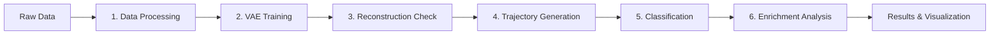

<div align="center">
  
</div>

# renalprog

**A Python package for simulating kidney cancer progression with synthetic data generation and machine learning**

[](https://www.python.org/downloads/)
[](https://cookiecutter-data-science.drivendata.org)
[](https://github.com/astral-sh/ruff)
[](https://opensource.org/licenses/Apache-2.0)

<p align="center">
  <sub>Logo: <a href="https://www.flaticon.com/free-icons/kidneys" title="kidneys icons">Kidneys icons created by Smashicons - Flaticon</a></sub>
</p>

---

## Overview

`renalprog` is a comprehensive bioinformatics pipeline for analyzing kidney cancer (KIRC) progression using deep learning and pathway enrichment analysis. The package integrates **Variational Autoencoders (VAEs)** with **differential expression analysis** and **gene set enrichment** to model cancer progression trajectories.

### Scientific Context

Cancer progression is a complex, dynamic process involving multiple molecular alterations across time. Traditional static analyses fail to capture the temporal dynamics of tumor evolution. `renalprog` addresses this challenge by:

1. **Learning latent representations** of gene expression data using deep generative models (VAEs)
2. **Generating synthetic trajectories** between cancer stages in latent space
3. **Identifying enriched biological pathways** along progression trajectories
4. **Classifying cancer stages** using interpretable machine learning

This approach enables researchers to:

- Identify key biological pathways driving cancer progression
- Predict patient outcomes based on molecular profiles
- Understand the temporal dynamics of tumor evolution

---

## Key Features

### 🔬 Data Processing
- Automated filtering of low-expression genes
- Outlier detection using Mahalanobis distance
- Normalization and batch effect correction
- Integration with TCGA bulk RNA-seq datasets

### 🧠 Deep Learning Models
- **Variational Autoencoder (VAE)** and **Autoencoder (AE)** for unsupervised representation learning
- **Conditional VAE (CVAE)** for fully supervised tasks
- Support for custom architectures and hyperparameters
- GPU acceleration with PyTorch

### 🔄 Trajectory Generation
- Generate synthetic patient trajectories between cancer stages
- Interpolation in latent space and decoding to gene expression space
- Control for clinical covariates (age, gender)
- Export trajectory gene expression for downstream analysis
- Visualization of trajectories
- Integration with enrichment analysis pipeline

### 📊 Stage Classification
- XGBoost-based classification of early vs. late stage cancer
- Cross-validation and performance evaluation
- Gene signature discovery

### 🧬 Enrichment Analysis
- Integration with **pyDESeq2** for differential expression
- **GSEA** (Gene Set Enrichment Analysis) for pathway analysis
- Support for Reactome, KEGG, and other pathway databases
- Parallel (multi CPU and multi node) processing for large-scale analyses

### 📈 Visualization
- Comprehensive plotting functions for all analysis steps
- UMAP/t-SNE visualizations of latent space
- Pathway enrichment heatmaps
- Classification performance metrics
- Interactive plots with Plotly

---

## Quick Start

See [Quick Start Tutorial](tutorials/quickstart.md) for a complete example.

---

## Pipeline Overview

The `renalprog` pipeline consists of six main steps:



### Step 1: Data Processing
- Filter low-expression genes
- Remove outliers using Mahalanobis distance
- Normalize expression values
- Prepare clinical metadata

### Step 2: VAE Training
- Train deep generative models on gene expression data
- Learn low-dimensional latent representations
- Validate reconstruction quality

### Step 3: Reconstruction Validation
- Assess VAE reconstruction accuracy
- Visualize latent space structure
- Identify potential issues

### Step 4: Trajectory Generation
- Generate synthetic patient trajectories
- Interpolate between cancer stages
- Export trajectory gene expression

### Step 5: Classification
- Train XGBoost classifier for stage prediction
- Calculate SHAP values for interpretability
- Identify important gene signatures

### Step 6: Enrichment Analysis
- Differential expression analysis with DESeq2
- Pathway enrichment with GSEA
- Identify biological processes along trajectories

---

## Documentation Structure

### 📚 For New Users
Start with:

1. [Installation Guide](tutorials/installation.md) - Set up your environment
2. [Quick Start Tutorial](tutorials/quickstart.md) - Run your first analysis
3. [Complete Pipeline Tutorial](tutorials/complete-pipeline.md) - End-to-end workflow

### 🛠️ For Developers
Extend and customize:

1. [API Reference](api/index.md) - Complete function documentation
2. [Contributing Guidelines](contributing/guidelines.md) - Join development

---

## Citation

!!! warning "Cite renalprog"
    This citation is temporal and will be updated upon formal publication.

If you use `renalprog` in your research, please cite:

```bibtex
@software{renalprog2025,
  author = {Prol-Castelo, Guillermo and EVENFLOW Project},
  title = {renalprog: Simulating Kidney Cancer Progression with Generative AI},
  year = {2025},
  publisher = {GitHub},
  url = {https://github.com/gprolcastelo/renalprog}
}
```

See [How to Cite](citation.md) for additional references.

---

## License

This project is licensed under the Apache License 2.0 - see the [LICENSE](license.md) file for details.

---

## Support

- **Issues**: [GitHub Issues](https://github.com/gprolcastelo/renalprog/issues)
- **Discussions**: [GitHub Discussions](https://github.com/gprolcastelo/renalprog/discussions)
- **Email**: Contact the EVENFLOW Project team

---

## Acknowledgments

This work is supported by the EVENFLOW Project and builds upon numerous open-source tools and databases. See [Acknowledgments](acknowledgments.md) for complete credits.

---

## Quick Links

- [Installation Guide](tutorials/installation.md)
- [Quick Start Tutorial](tutorials/quickstart.md)
- [API Reference](api/index.md)
- [Contributing Guidelines](contributing/guidelines.md)

